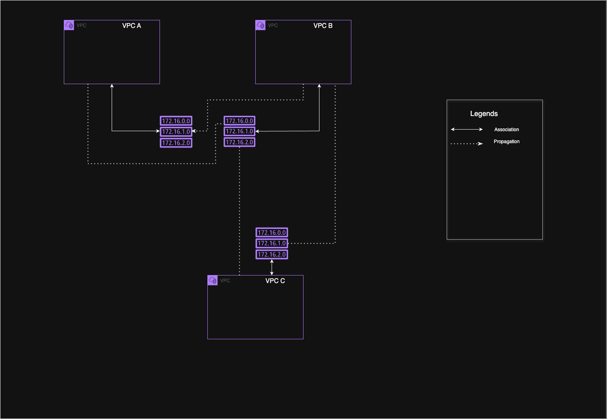

# Terraform-Labs-Networking

This repository contains hands-on labs using Terraform to pro``vision and manage various AWS networking components. These include VPCs, subnets, route tables, Internet Gateways, NAT Gateways, Transit Gateways, Route 53 DNS configurations, and more. Aimed at deepening infrastructure-as-code (IaC) and cloud networking expertise.

## Labs Overview

- **Lab 1: VPC and Subnets**
  - Create a VPC with public and private subnets.
  - Configure route tables for internet access.
    Image: 

## Contributors

Thank you Kayode Salawu:

- [Kayode Salawu](https://github.com/kaysalawu) – Code
